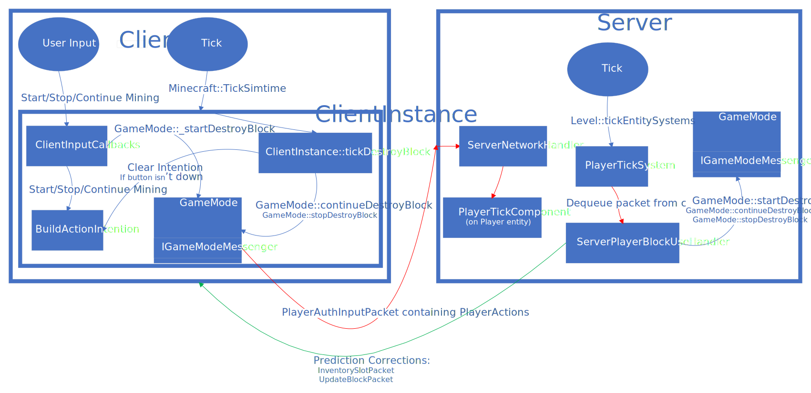

# Summary
This page describes how block breaking works in Minecraft, from the input being processed client side, through client prediction of state changes, to the server handling and response. At a high level, the client initiates the actions on its side based on user input which is used to predictively progress the mining animation and ultimately break the block in the world, as well as causing durability damage to the  item in hand if applicable. The intent to break blocks is then sent to the server, who performs the action on its side, authoritatively updates the relevant player, inventory, and world states, before broadcasting any updates to any nearby players. **There are currently two code paths for block breaking depending on the value of the "Server Authoritative Block Breaking" feature toggle**

The following elements are predicted by the client:
- Swinging animation
- Destroying the block in the world
- Applying durability damage to the item in hand
- Controller vibration on impact

These elements are initiated by the server in response to the client's input:
- Block cracking progress (cracks along the surface of the block, not particles coming out of the block: `LevelEvent::UpdateBlockCracking`)
- Particles coming out of the block while it's being broken (`LevelEvent::ParticlesCrackBlock`)
- The sound and burst of particles when destroying a block (`LevelEvent::ParticlesDestroyBlock`)

---

# Authority with the server authoritative toggle off

- Client sends `PlayerBlockAction`s to start/stop/continue mining
- Server receives these and performs the visual effects of it. No logic or validation in `GameMode` takes place.
- Client uses a legacy transaction to request destruction of the block and durability damage on the item in hand.
- Server performs this destruction as long as it agrees the client is holding the specified item. Position validation takes place, but not meaningfully, since it's based on a position provided by the client. No validation of block break progress takes place. Item durability is also changed by this legacy transaction.

# Authority with the server authoritative toggle on
- Client sends `PlayerBlockAction`s to start/stop/continue mining
- Server receives these and performs them on the player's instance of `GameMode` like the client does, but with the server authoritative item/player state.
- When the client predicts a block is broken, it notifies the server of this prediction with a `PlayerBlockAction`. Note that this prediction is guaranteed to be sent on the same frame as the input that will cause the block destruction on the server, given reliable ordered packets.
- The server processes the player actions as normal. When a block is broken or a prediction received, the server validates that it agrees with the client's prediction, or lack thereof, and corrects the client if necessary. For example, if the server broke a block and the client didn't predict it: correction. If the client predicted destruction but the server didn't compute destruction: correction.
- Note that the target block is still client authoritative with a distance check for validation. The server is not doing raycasts using player orientation to determine target blocks.
- **Creative mode is an exception and is still client authoritative**

---

# Relevant Classes

Here is a diagram showing most of the relevant flow of calls and classes. Some of the specifics are not in the diagram to avoid it getting too messy.

> ClientInputCallbacks

This is the first important place that user inputs land. The intention of the input is ultimately determined and stored on the `BuildActionIntention` referred to everywhere as `BAI`. `ClientInputCallbacks` calls into `GameMode` to start the destroy block progress, but does not stop or continue it, that responsibility belongs to `ClientInstance::tickDestroyBlock`

> BuildActionIntention

Holds the intention of the user input (interact, build, destroy, etc.) to be read and cleared from all over `ClientInstance`, as well as `ClientInputCallbacks`.

> ClientInstance

Does lots, relevant to block breaking is `ClientInstance::tickDestroyBlock`, which calls into `GameMode`, either to continue destroying or stop destroying, depending on what the current input state is. Here the `BuildActionIntention` will be cleared if the user stopped holding the button. Note that this tick is as part of the simulation update before the input packet has been sent for the frame. At the end of the frame the input packet will be sent, which contains movement input, as well as any player actions, like starting to destroy a block or predicting the destruction of one.

> GameMode

Contains all of the business logic for incrementing progress of block destruction as well as doing the actual destruction of the block. Logic within this class is unaware of client vs server, anything that differs between the two is delegated to the `IGameModeMessenger` interface.

> IGameModeMessenger

This is an abstraction to perform the relevant state modification or communication appropriate to the situation. It encapsulates the decision of if the server authoritative block breaking toggle is enabled as well as server vs client logic to execute as a result of `GameMode` logic. Clients use this to queue up inputs and predictions to be sent to the server, while the server uses this to perform the durability modification of the item as well as broadcast the resulting particle effects and sounds.

> ServerPlayerMovementComponent/ServerPlayerMovementSystem

`PlayerAuthInputPacket`s are enqueued onto the `ServerPlayerMovementSystem` to be processed in line with the `IPlayerTickPolicy` on the `PlayerTickComponent`. This is to allow the throttling of movement packets if desired to prevent an exploit where users can move faster by sending input packets faster. The system is ticked like any other ECS system by the level's `tickEntitySystems` method.

> ServerPlayerBlockUseHandler

This is a hub of methods called from `ServerNetworkHandler` that relate to block breaking, grouped here for ease of understanding. Here the `PlayerBlockAction`s that were packed into the `PlayerAuthInputPacket` by the client's `IGameModeMessenger` are processed, forwarding the relevant actions to the server's instance of `GameMode` for the given player. This is also were client predictions for block breaking are validated and corrected if necessary.

---

# Relevant Packets

> PlayerAuthInputPacket

This is sent by the client at the end of the simulation frame and contains movement as well as block related actions in the form of `PlayerBlockActions`. The item modification prediction is also stuffed in here, which is either a legacy transaction or the new item stack request action, depending on if the server authoritative block breaking toggle is on. Note that the processing of this packet is deferred in `ServerPlayerMovementComponent` and later dequeued by `ServerPlayerMovementSystem`. This deferred processing is the reason that some actions are stuffed into `PlayerAuthInputPacket`: so that the relative ordering of those actions can be preserved if it was determined that the order was essential to keeping the client and server in sync.

> PlayerActionPacket

Some player actions are now stuffed in `PlayerAuthInputPacket`, although there are still a few that go through this standalone packet since it wasn't deemed critical for them to be packed in for the sake of ordering.

> LevelEventPacket

Used to broadcast the effects and sounds related to block destruction. Note that the client does not predictively start these, they wait until the server sends them back in response to the inputs the client sent.

> LevelSoundEventPacket

Sent by `ClientInputCallbacks` if the player swung to destroy a block but missed or wasn't allowed to destroy it. Also by `GameMode` for impacts while mining.

> InventoryTransactionPacket (subset packed into `PlayerAuthInputPacket`)

If the server authoritative block breaking toggle is off, this is sent (not fully sent, the transaction is packed in `PlayerAuthInputPacket`) to perform block breaks and modify in hand item durability. Not sent with the toggle off.

> ItemStackRequestPacket (subset packed into `PlayerAuthInputPacket`)

If the server authoritative block breaking toggle is on, the batch is sent as part of the `PlayerAuthInputPacket`. Not sent with the toggle off.

> UpdateBlockPacket

Sent by the server to correct the client if they mispredicted or failed to predict the destruction of a block.

> InventorySlotPacket

Sent by the server to correct the client on item durability if they predicted wrong. This is common for the unbreaking enchant since it has a random element. Note that this form of correction is only used if the source item mismatched or no item prediction was provided. If that is not the case, the correction can be handled by rejecting the `ItemStackRequestAction` for item durability change. See the section below for a description of how the durability modification works.

> ItemStackResponsePacket

Sent by the server in response to client predictions about item durability changes using `ItemStackRequestAction`. This either acknowledges the client's prediction, causing the client to propagate the prediction from the sparse container to the backing container, or rejects it, in which case the prediction is discarded, never having modified the backing container. Note that the durability is supplied here so that predictions can be accepted with the caveat of adjusting the durability value.

---

# Following the end-to-end of a block action

## Client side

Input begins in `ClientInputCallbacks` after several layers of mappings to abstract away input device specifics. The intention of the action (destroy, build, interact, etc.) is stored on the `ClientInstance`s `BuildActionIntention` (referred to as BAI) where it can later be referred to within various parts of `ClientInstance` logic. If the player is targeting a block and in an input mode that is able to mine (not already using an item for example) then `GameMode::startDestroyBlock` is called. Doing so initializes the in progress block and signals the intent to destroy a block via `Player::isDestroying`. Note that in creative a different code path is taken that instead breaks the block immediately and with client authority.

Later on in the frame the `Minecraft` instance is ticked, and at the beginning of that simulation tick `ClientInstance::tickDestroyBlock` is called. If destruction has started as specified above via `ClientInputCallbacks` and hasn't stopped yet, this will advance the destructive progress. That either means calling `GameMode::continueDestroyBlock` with the latest `HitResult` that the player is looking at (may be the same as last frame) or calling `GameMode::stopDestroyBlock` if input is no longer being held down. Note that this is taking place at the beginning of the simulation tick, which is before the input for the frame is sent to the server. This means any result computed during this call to `GameMode` should match what the server will compute when processing the upcoming input packet. Also note that `GameMode::continueDestroyBlock` continues even if the player is swinging at air after having broken a block. It only stops if the input is raised or a permissions restricted block is hit, as decided by the return value of `GameMode::continueDestroyBlock`. Any block actions caused by this call or in `ClientInputCallbacks` are stored on the `PlayerActionComponent` to be packed into the `PlayerAuthInputPacket` at the end of the frame.

At the end of the frame, `LocalPlayer::sendInput` packs any actions that may have happened in the frame from the `PlayerActionComponent` and sends it to the server.

## Server side

All input relevant to block breaking comes from within the `PlayerAuthInputPacket`. Upon receipt in `ServerNetworkHandler` the packet is immediately enqueued for later in `ServerPlayerMovementComponent` which is processed in accordance with the `IPlayerTickPolicy` on the `PlayerTickComponent`. This is to prevent fast move exploits where the player increases the rate of their input packets to move faster.

Logic relevant to block breaking calls into one of the methods in `ServerPlayerBlockUseHandler` upon processing of the `PlayerAuthInputPacket` containing the packet data of block break actions. The bulk of the work is in `ServerPlayerBlockUseHandler::onBeforeMovementSimulation` which is sort of the equivalent to `ClientInstance::tickDestroyBlock` except unlike the client, `startDestroyBlock` is also called here. The server applies the action provided by the client, or if none was provided but block destruction is in progress, then `GameMode::continueDestroyBlock` with the previously provided `HitResult` is implied. If the client predicted a block destruction and/or the server computed a block destruction as part of advancing `GameMode` logic, then it validates that the client supplied the expected prediction. This includes ensuring that destruction was predicted if it should be, wasn't if it shouldn't, and validating that the predicted block and item durability change is accurate. Note that it is guaranteed that this frame will contain the client's prediction if the client is in sync, no deferred checking mechanism is needed, because the client advances their logic before sending the input packet, and puts the prediction in said input packet.

As a side effect of applying the block actions the server will also broadcast particle events to all players, including the one that sent the input, since they don't predict particles. Block cracking has some unique handling, both for the particles coming out of the block during progress as well as the cracks along the block's face. With the toggle off the player requests these particles to be updated every frame during mining as part of `Player::crackBlock`. With the toggle on the server is following along with block progress so the client doesn't need to request it every frame. In both cases, the server broadcast is done in `ServerPlayerBlockUseHandler`. `LevelEvent::ParticlesCrackBlock` is the normal particle effect. `LevelEvent::UpdateBlockCracking` is for the cracks along the block's face, however, broadcasting this only updates the rate of change of the cracking effect, it doesn't advance the block cracking. The client advances it themselves as part of `LevelRendererPlayer::updateDestroyProgress`, called during rendering, where all active block cracking animations have been stored as part of previous `LevelEvent::StartBlockCracking` events that have  not yet been cancelled by `LevelEvent::StopBlockCracking`. Because of this, it is not necessary to send `LevelEvent::UpdateBlockCracking` unless the speed of mining changed, for instance if the player switched tools while mining. Nevertheless, it is broadcast every frame by the server regardless.

Item predictions are forwarded to `ItemStackNetManager` which is discussed in more detail in its own section below. Finally, the server will send corrections in the form of `UpdateBlockPacket` and `InventorySlotPacket` if necessary. In most cases a correction is not needed since the client will predict properly.

## Back to client

At some point later the client will receive a response to their item prediction, either accepted or rejected. If a correction was sent, the client will process it as normal, there is nothing block break specific about the handling of the corrections or the item prediction response.

---

# Prediction and modification of item durability during mining

Modifying item durability is a surprisingly tricky part of block break logic because it involves the client making frequent predictive changes to items in the hotbar. With the toggle off, the legacy `ItemUseInventoryTransaction` was responsible for the client authoritatively requesting the modification of durability and destruction of the block in the world. The server does minimal validation and calls directly into `GameMode::destroyBlock` without first checking progress or anything, because the server isn't tracking destroy block progress.

Most item modifications (container ui for instance) are initiated by the client who is requesting an action. The server then validates the request, performs or rejects the action, then informs the client if necessary. In the legacy system these action requests would contain full item stacks, and be corrected with full item stacks for a given slot, or sometimes even by resending the entire inventory. `ItemStackRequestAction` on the other hand, refers to items using net ids to represent an agreed upon item state. When a request is made the server must validate that they agree with the item state as represented by this net id, and only then can they perform the requested action. Performing the action may result in the net id of the item changing, in which case the response sent to the client will contain the new id. Regardless of acceptance or rejection, a response is always sent. Upon receiving an accepted response, the client propogates the prediction from the sparse container to the backing container, solidifying the predicted item modification as confirmed. If the server rejects the response, the prediction is discarded from the sparse container, meaning no invalid state was ever introduced to the backing container. In general the server should always be able to understand what id the client is referring to because all item modifications would be requested by the client in this fashion. If the server rejects the request, no item data is sent back, only a rejection, which the client then uses to throw out the prediction they made. Predictions made off of other unconfirmed predictions fit into this id system as well, the details of which are outside the scope of this document.

The request/response structure doesn't fit perfectly into gameplay related actions like mining a block, where a player input causes an item change and a change in the world. To suit this unique scenario, a new `ItemStackRequestActionMineBlock` was added, which contains two part validation. The first validation step happens as part of the block break logic of `ServerPlayerBlockUseHandler::onBeforeMovementSimulation` where the request will be rejected if there was something wrong with the predicted block break, like the block not actually being broken, or if the net id of the item in hand couldn't be interpreted by the server, in which case an `InventorySlotPacket` for that slot is manually sent. As explained above, the net id should always be valid, this extra correction case is done as a precaution since legacy item modifications still exist for other gameplay related actions in the hotbar that may interfere. This first phase of validation is flagged as `ItemStackRequestActionMineBlock::setPreValidationStatus`.

Later on the action is processed as part of `ScreenHandlerHUD::handleAction`. Here the source net id is once again validated to make sure the server is still in agreement with the client's prediction. If so, the server accepts the request, while providing an updated durability value if necessary. Out of date durability could happen either through use of the unbreaking enchantment (which randomly prevents durability loss), or due to deferred processing of the `ItemStackRequestAction` due to sift text filtering within `ItemStackNetManager`. All item action requests are in the same queue, so it is not expected that text filtering would be done on a mine request, although it is possible that a previous request is still being processed, so the mine request must wait.

For more documentation about `ItemStackNetManager` see the [bedrock-docs repo](https://github.com/Mojang/bedrock-docs/tree/master/GameplaySystems/ServerAuthInventory/Design)

---

# ItemStackNetManager scene stack

Block breaking was the first item interaction to take place from the hud to use a predictive action through the new `ItemStackNetManager` system. Normally when predictions for a container are made, they are relative to a particular screen. Closing a screen is deferred until the server allows it, ensuring that no in flight predictions will come in for a screen that no longer is open. The HUD is a unique case, because it is sort of always open. For this reason, the notion of a scene stack was added for block breaking requests. Currently, the top of the stack is used for all requests except the new `ItemStackRequestActionMineBlock` which is known to be a HUD screen action, so it's hardcoded to use the bottom of the stack. This allows the mining predictions to not require any new delays to opening other screens, and not unexpectedly appearing on screens that don't understand how to handle the request.
