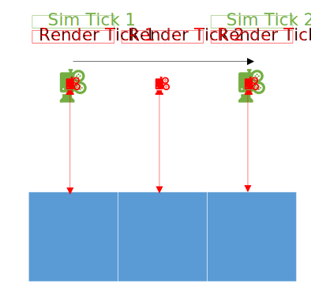
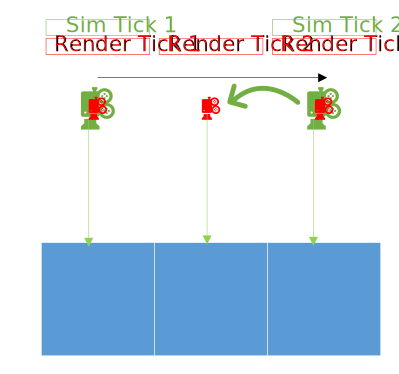

# Simulation and Input Update Frequency for Build Actions

## Motivation

For general slow moving gameplay the update frequency of input vs simulation doesn't matter much. Fast building or destruction in creative however, exercise some tricky edge cases because the player may be moving more than one block per simulation frame, while still expecting to place/destroy all blocks in a continuous line. Here are some more common scenarios that are supposed to be supported:

- Sprint fly in one direction while keeping the camera looking down, destroying all blocks that pass the cursor during the fly-by.
- Jump off a high spot and break a column of blocks on the way down.
- Build a block below another, then look at the horizon and fall down. A column of blocks will be created as long as the bottom face was targeted on the topmost block due to "block snapping" behavior.
- Fly backwards while looking in the opposite direction of movement, creating a trail of blocks. This trail of blocks should keep up with the player.

These scenarios involve the player moving faster than one block per simulation tick, so if block destruction logic was updated by only using the latest raycast from the player's cursor, some blocks would be skipped when trying to create/destroy a continuous line of blocks. The solution to this problem has changed significantly since the introduction of server authoritative block breaking. This document explains how this scenario worked before the server authority changes to give some context to then explain how the scenario is solved after the server authoritative changes. The critical difference between the before and after is that the simulation frequency of block related updates changed from being at the render rate to the simulation rate. This change was made regardless of if the server authoritative block breaking toggle is enabled. More detail on why it was done this way towards the end of this document.

---

## How the fast block destruction delay works in Survival

In survival the delay between destroying blocks is always `GameMode::creativeDestructionTickDelay` which is 250ms, unless a tool is efficient enough to damage through a block's durability in one tick, in which case there is no delay. An example of this is using an efficiency 5 diamond shovel on dirt. This delay is cancelled out by targeting a different block while mining.

See `GameMode::continueDestroyBlock` for details.

---

## How the fast block destruction delay works in Creative

Creative mode has a completely different code path for determining this delay to facilitate quickly building/destroying columns and rows of blocks. If the player is standing still the delay works the same as survival. Once the player starts moving, the timing delay is no longer the limiting factor. Instead, distance travelled dictates when the player is allowed to break the next block. Once the player has travelled at least one block away, the destruction is performed, and the remainder of distance beyond the single block distance is applied towards the distance for the next allowed destruction.

See `GameMode::continueDestroyBlock` for details.

---

## How the fast block building delay works

The creation time of the last block is marked whenever a block is created. From this point on there is a variable length delay until the next build is allowed which depends on the player's speed. The delay is rather arbitrary, so showing the code provides as much insight as I could describe. DeltaTime is in milliseconds:

```
	float deltaTime = 200.0f;

	if (mPlayer.isSneaking() || mLastBuildBlockWasInteractive || (mLastBuildBlockWasSnappable && !mHasBuildDirection)) {
		deltaTime = 300.0f;
	}
	else if (currentPlayerSpeed > 0.0f) {
		// For some reason I need to bias it so that with any movement we go to about a 180 or less delay. Otherwise you can escape the building and get out of range.
		deltaTime = std::min(180.0f, 900.0f / currentPlayerSpeed);
	}
```

Once this amount of time has elapsed the player can build the next block.The placement is varied based on if the player is sneaking and if the given blocks are "snappable", meaning the building logic assists creating rows of them. The key takeaway is that the build location is not strictly based on the straight `HitResult`, as it's slightly massaged to try to assist the player. After building the block during a progressive build (holding the mouse down) the last build time is adjusted so that the remainder of delay time immediately applies towards the next build.

See `GameMode::continueBuildBlock` for details.

---

## Build action tick rate before server authority



`ClientInputCallbacks` calls directly into `GameMode` to begin build/destroy operations, then input ticks (part of render frames) would tick `GameMode` logic responsible for progressive building or destruction. Due to the unstable update rate of `GameMode` logic, real-time deltas were used to compute progress of actions or cooldowns. This means that if the player is flying 2 blocks per simulation tick and looking down at a row of blocks while holding the mouse down, all of them will be destroyed, as long as their frame rate is at least 40. This is because the simulation rate is 20 ticks per second. If the client's render rate is 40 ticks per second, then there will be at least one render in between simulation ticks. During this render the player will be partially interpolated from the current frame to the previous one, so the raycast computed on that frame can hit the first block the player passes. At the end of the frame the player is no longer targeting that same block, but that's fine because `GameMode` was informed of the block during that render tick. Above is an illustration of this scenario, where each line indicates a build action update to `GameMode`.

---

## Build action tick rate after server authority



`ClientInputCallbacks` still calls directly into `GameMode` to begin build/destroy operations. However, now progressive actions are only updated on simulation ticks, before the rest of the game is updated. Instead of using real time, time is ticked at a fixed rate as part of `GameMode::tick` behind the `IGameModeTimer` interface. This by itself is not enough to support the fast moving scenarios, as now if the player is flying fast enough, they will entirely pass over a block, so the player never attempts to build/destroy the blocks it only sees in-between simulation ticks. To account for this, render ticks accumulate `HitResult` objects on the player's `HitResultComponent`. All of these are processed in the next simulation tick. As an optimization, redundant `HitResults` are merged within `IHitResultContainer` to avoid processing an action on the same block multiple times. This scenario is pictured above, where each green line indicates processing a `HitResult` on a simulation frame, but from the perspective of a past render frame as seen in render tick 2.

---

## Why server authority changed the tick rate of build actions

The server has no notion of render ticks, only simluation ticks. Allowing the player to perform actions in between simulation ticks results in tricky edge cases when trying to validate client timing on the server. If the client is allowed to start counting on a cooldown during a render frame, then they are effectively getting a head start compared to the server, since the client starts counting before the simulation frame, then only notifies the server of the input to the relevant action at the end of the frame. This means the client could have counted up to just under 2 ticks worth of time, while for the server only one tick has elapsed.

To further complicate matters, input is updated before the timer for the Minecraft simulation is ticked. This means that the input logic cannot know if the current render tick will also update the simulation, and how many times the simulation will be ticked before the next render tick. This makes it difficult to add the correct block related actions to the input packet on the correct frame that the server will agree with when validating timing on their side.

To simplify all of this, the ticking of build action logic was moved to the beginning of the simulation frame. This means it is clear which input packet the build actions (if any) will be added to: this frame. Sub-frame timing is also simplified because now the client only officially starts their actions in line with a simulation tick instead of some arbitrary point between frames. It also allows the server to authoritatively simulate block actions with frame perfect precision to what the client predicts, instead of having to add fuzzy windows to account for the client's framerate.
