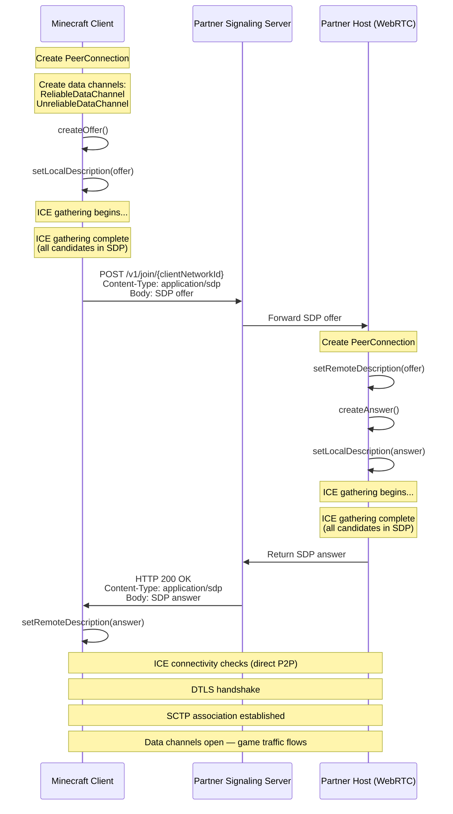

# NetherNet HTTP Signaling — Partner Onboarding Guide

## Table of Contents

1. [Introduction](#1-introduction)
2. [WebRTC Primer](#2-webrtc-primer)
3. [Architecture Overview](#3-architecture-overview)
4. [HTTP Signaling Protocol](#4-http-signaling-protocol)
5. [Identity Assertions](#5-identity-assertions)
6. [WebRTC PeerConnection Configuration](#6-webrtc-peerconnection-configuration)
7. [Connection Flow](#7-connection-flow)
8. [SDP Examples](#8-sdp-examples)
9. [NetworkID](#9-networkid)
10. [Troubleshooting Client Connections](#10-troubleshooting-client-connections)

---

## 1. Introduction

**NetherNet** is Minecraft's peer-to-peer networking transport layer built on [WebRTC](https://webrtc.org/). It establishes direct data-channel connections between game clients and servers using standard WebRTC offer/answer negotiation.

This guide documents the **HTTP signaling protocol** that the Minecraft client uses to exchange WebRTC session descriptions with a server as well as the data channel format used on the connection. By implementing the protocol described here, partners can build a signaling inteface that bridges the Minecraft client to their server infrastructure.

### Scope

This document covers:

- The HTTP signaling endpoint the client calls and the request/response format it expects.
- The WebRTC `PeerConnection` configuration the client uses, so the partner can create a compatible peer.
- The end-to-end connection flow from offer creation through data-channel open.

---

## 2. WebRTC Primer

If you are already familiar with WebRTC, you can skip to [Section 3](#3-architecture-overview).

### SDP (Session Description Protocol)

SDP is a text format that describes a peer's media and data-channel capabilities, supported codecs, network addresses, and security parameters. In WebRTC, two peers exchange SDP documents — an **offer** and an **answer** — to agree on connection parameters.

### ICE (Interactive Connectivity Establishment)

ICE is the process by which peers discover network paths to each other. The ICE agent gathers **candidates** — possible IP address and port combinations — and tests them for connectivity. Candidate types include:

| Type | Description |
|------|-------------|
| **Host** | A local address on the machine's network interface. |
| **Server-reflexive** | The public address as seen by a STUN server (NAT traversal). |
| **Relay** | An address allocated on a TURN relay server (fallback when direct paths fail). |

### Full ICE vs. Trickle ICE

- **Trickle ICE**: candidates are sent to the remote peer incrementally as they are discovered, in parallel with the offer/answer exchange. This can reduce setup time.
- **Full ICE**: all candidates are gathered *before* the offer or answer is sent. The SDP contains every candidate the peer discovered.

**NetherNet's HTTP signaling uses full ICE** (trickle ICE disabled). The entire SDP — including all ICE candidates — is transmitted in a single HTTP request and response. This simplifies the signaling protocol to a single round-trip but means that candidate gathering must complete before the SDP is sent.

### STUN and TURN

- **STUN** servers help a peer discover its public (server-reflexive) address.
- **TURN** servers act as relays when direct connectivity is not possible.

> **Note:** We do **not** recommend configuring STUN or TURN servers when using HTTP signaling. Because trickle ICE is disabled, every configured STUN/TURN server must be contacted *before* the SDP can be sent, which adds latency to connection setup. If relay connectivity is required, consider alternative approaches.

### Data Channels

WebRTC data channels provide bidirectional transport for arbitrary application data (as opposed to audio/video media). NetherNet uses data channels exclusively — no audio or video tracks will be requested by a legitimate Minecraft client.

---

## 3. Architecture Overview

```
┌──────────────┐         HTTPS          ┌──────────────────────┐
│              │ ─────────────────────► │                      │
│   Minecraft  │   POST /v1/join/{id}   │   Partner Signaling  │
│    Client    │   Body: SDP offer      │       Server         │
│              │ ◄───────────────────── │                      │
│              │   200 OK               │                      │
│              │   Body: SDP answer     │                      │
└──────┬───────┘                        └──────────────────────┘
       │
       │  WebRTC P2P (DTLS + SCTP)
       │
       ▼
┌──────────────┐
│   Partner    │
│    Host      │
│  (WebRTC)    │
└──────────────┘
```

1. The Minecraft client gathers a complete SDP offer (with all ICE candidates).
2. The client sends the offer to the partner's signaling server via a single HTTP POST.
3. The signaling server is responsible for getting the offer to the host and returning the host's SDP answer in the HTTP response.
4. Once the client receives the answer, WebRTC ICE connectivity checks run directly between the client and host.
5. When connectivity is established, SCTP data channels open and game traffic flows peer-to-peer.

The signaling server is only involved during the initial SDP exchange. After that, all traffic flows directly between the client and host over the WebRTC connection.

---

## 4. HTTP Signaling Protocol

### Capability Check and Server Info

Before initiating a WebRTC connection, the client calls the `GET /v1/join` endpoint. This serves two purposes: it verifies that the server supports NetherNet connections, and it retrieves basic server metadata used by the client (for example, to display server details prior to connecting).

```
GET {serverUrl}/v1/join
```

| Field | Value |
|-------|-------|
| Method | `GET` |
| URL | `{serverUrl}/v1/join` |

#### Response

| Field | Value |
|-------|-------|
| Status | `2xx` if NetherNet is supported; any non-`2xx` status (e.g., `404`) indicates NetherNet is not supported. |
| Content-Type | `application/json` |
| Body | A JSON object describing the server, as documented below. |

The response body is a JSON object with the following fields:

| Field | Type | Description |
|-------|------|-------------|
| `name` | string | Human-readable server name. |
| `protocol` | number | Bedrock protocol version supported by the server. |
| `version` | string | Bedrock game version string (e.g., `"1.26.50"`). |
| `level` | string | Name of the level (world) currently loaded on the server. |
| `players` | number | Current player count. |
| `maxPlayers` | number | Maximum number of players the server will accept. |
| `gameType` | number | Default game mode (0 = Survival, 1 = Creative, 2 = Adventure). |

Example:

```json
{
  "name": "Dedicated Server",
  "protocol": 2177,
  "version": "1.26.50",
  "level": "Bedrock level",
  "players": 0,
  "maxPlayers": 10,
  "gameType": 0
}
```

If the server does not support this endpoint (non-`2xx` status), the client will not attempt a WebRTC connection.

### SDP Exchange

```
POST {serverUrl}/v1/join/{networkId}
```

| Component | Description |
|-----------|-------------|
| `{networkId}` | The client's `NetworkID` — an opaque string that uniquely identifies the client (see [Section 9](#9-networkid)). |

### Request

| Field | Value |
|-------|-------|
| Method | `POST` |
| URL | `{serverUrl}/v1/join/{networkId}` |
| Content-Type | `application/sdp` |
| Body | Raw SDP offer text (UTF-8). Contains the complete offer including all ICE candidates. |

### Response

| Field | Value |
|-------|-------|
| Status | `2xx` for success; any other status is treated as a failure. |
| Content-Type | `application/sdp` |
| Body | Raw SDP answer text (UTF-8). Must contain the complete answer including all ICE candidates. |

### Behavior

- The client sends **exactly one** HTTP request per connection attempt.
- On HTTP `2xx`: the client parses the response body as an SDP answer and proceeds with WebRTC negotiation.
- On any non-`2xx` status: the client reports a signaling failure and the connection attempt ends.
- The client does not retry on failure. A new connection attempt would produce a new HTTP request.

---

## 5. Identity Assertions

NetherNet uses `a=identity` attributes (defined in [RFC 8827 §5](https://www.rfc-editor.org/rfc/rfc8827#section-5)) in **both directions** of the SDP exchange:

- **In the offer**, the client asserts the authenticated player's identity. The server validates this to decide whether to admit the player. See [§5.1 Validating the Client Assertion in the Offer](#51-validating-the-client-assertion-in-the-offer).
- **In the answer**, the server asserts a long-lived operator identity. The client uses this for a **Trust On First Use (TOFU)** check — pinning the operator's public key on the first connection and re-checking it on every subsequent connection. See [§5.2 Producing the Server Assertion in the Answer](#52-producing-the-server-assertion-in-the-answer).

Both assertions share the **same on-the-wire envelope** — a base64-encoded JSON object containing an `idp` block and an opaque `assertion` string. The internal `assertion` always carries a JWT plus a detached JWS over the SDP's `a=fingerprint` lines, signed with the private key corresponding to the `cpk` (public key) claim in the JWT. The two directions differ only in what the JWT is and how the verifier anchors trust in it.

### 5.1. Validating the Client Assertion in the Offer

The client embeds its assertion in the SDP offer body of `POST /v1/join/{networkId}`. The server should validate it before forwarding the offer or generating an answer.

#### What the Client Sends

The SDP offer will contain a session-level `a=identity` attribute. This attribute carries a base64-encoded JSON object with the following structure:

```json
{
  "idp": {
    "domain": "<auth-service-domain>",
    "protocol": "default"
  },
  "assertion": "<assertion string>"
}
```

| Field | Description |
|-------|-------------|
| `idp.domain` | The domain of the Minecraft auth service that issued the `GameServerToken`. |
| `idp.protocol` | Always `"default"`. |
| `assertion` | A JSON string containing the token and signed fingerprints, defined below. |

The `assertion` field is a string containing:

```json
{
  "token": "<GameServerToken JWT>",
  "fingerprints": "<detached JWS (compact serialization)>"
}
```

| Field | Description |
|-------|-------------|
| `token` | A `GameServerToken` JWT issued by the Minecraft auth service. Contains the player's identity claims (XUID, PlayFabId, UUID, permissions) and a `cpk` (client public key) claim. |
| `fingerprints` | A detached JWS ([RFC 7515, Appendix F](https://www.rfc-editor.org/rfc/rfc7515#appendix-F)) in compact serialization: `<base64url(header)>..<base64url(signature)>`. The payload is omitted because it can be reconstructed from the SDP `a=fingerprint` lines. |

#### Where It Appears in the SDP

The `a=identity` attribute is a session-level attribute. It appears after the `a=fingerprint` lines and before the first `m=` line:

```
v=0
o=- 1181923068 1181923196 IN IP4 0.0.0.0
s=-
t=0 0
a=fingerprint:sha-256 4A:AD:B9:B1:3F:82:18:3B:54:02:12:DF:3E:5D:49:6B:19:E5:7C:AB
a=identity:eyJpZHAiOnsiZG9tYWluIjoiYXV0aC5taW5lY3JhZnQub3JnIiwicHJvdG9jb2wi...
m=application 9 UDP/DTLS/SCTP webrtc-datachannel
...
```

#### Validation Steps

When the server receives an SDP offer, it should validate the identity assertion before proceeding with WebRTC negotiation:

1. **Parse `a=identity`.** Extract the attribute value from the SDP. Base64-decode it and JSON-parse to obtain the `idp` and `assertion` fields.

2. **Extract token and signed fingerprints.** Parse the `assertion` string as JSON to obtain the `token` and `fingerprints` fields.

3. **Validate the `GameServerToken` JWT.** Verify the JWT signature against the Minecraft auth service's public keys. This yields the player's identity claims, including the `cpk` (client public key).

4. **Reconstruct the fingerprint payload.** Extract all `a=fingerprint` attributes from the SDP and serialize them as **canonical JSON** (keys sorted lexicographically, no extra whitespace):
   ```json
   {"fingerprint":[{"algorithm":"sha-256","digest":"4A:AD:B9:B1:3F:82:18:3B:54:02:12:DF:3E:5D:49:6B:19:E5:7C:AB"}]}
   ```

5. **Verify the detached JWS.** Using the `cpk` public key from the validated token:
   - Read the `alg` header from the JWS (e.g., `ES384`).
   - Reconstruct the JWS signing input: `base64url(header).base64url(canonical_fingerprint_json)`.
   - Verify the signature.

   A valid signature proves that the authenticated player (the token holder) is the entity that generated the DTLS certificate whose fingerprint is in the SDP.

6. **Authorize the player.** Use the identity claims from the token (XUID, UUID, permissions, etc.) to decide whether to allow the connection — for example, checking allowlists, banlists, or player limits.

7. **Strip `a=identity` before setting the remote description.** WebRTC implementations will reject unknown SDP attributes. Remove the `a=identity` line from the SDP before passing it to `setRemoteDescription()`.

#### Canonical JSON

Because the `fingerprints` field uses a detached JWS (payload omitted), both the client and server must produce identical bytes when serializing the fingerprint structure. The canonical JSON rules are:

- Object keys are sorted lexicographically (by Unicode code point).
- No insignificant whitespace — no spaces after `:` or `,`, no newlines or indentation.
- No trailing commas.
- Strings use minimal escaping (only characters required by RFC 8259).

This is a subset of [RFC 8785 (JSON Canonicalization Scheme)](https://www.rfc-editor.org/rfc/rfc8785).

#### Security Properties

The assertion creates a verified chain from the auth service to the DTLS transport:

```
Auth Service ──signs──► GameServerToken (contains cpk)
                              │
                    cpk private key signs
                              │
                              ▼
                    a=fingerprint values (in SDP)
                              │
                WebRTC enforces match with
                              │
                              ▼
                    DTLS certificate (at handshake)
```

- **MITM prevention:** An attacker who modifies the `a=fingerprint` values in the SDP cannot produce a valid signature without the `cpk` private key. An attacker who replays original signed fingerprints cannot complete the DTLS handshake without the corresponding DTLS private key.
- **Early rejection:** Invalid or unauthorized players can be rejected at signaling time — before ICE/DTLS negotiation — saving resources.
- **No post-DTLS verification needed:** Because WebRTC enforces that the DTLS certificate matches the `a=fingerprint` values, and the assertion proves the authenticated identity owns those fingerprints, no additional verification is needed after the DTLS handshake.

#### Missing Assertions

If the SDP offer does not contain an `a=identity` attribute, the server may either:
- **Reject** the connection if authentication is required.
- **Allow** the connection for open/unauthenticated scenarios.

This is a server policy decision.

### 5.2. Producing the Server Assertion in the Answer

The Minecraft client expects every SDP answer to contain a server-side `a=identity` attribute. The server **must always include it**, regardless of whether signaling is reached over HTTPS or plaintext HTTP. What changes with the transport is how the client *uses* it — specifically, whether the player ever sees a trust prompt.

#### How the Client Anchors Trust (HTTPS vs. Plaintext HTTP)

The client picks a trust anchor based on how it reached the signaling endpoint:

- **HTTPS signaling — TLS is the trust anchor.** When the client reached `/v1/join/{networkId}` over a TLS connection with a valid server certificate, the TLS handshake already authenticated the server endpoint and protected the SDP answer in transit. The client trusts the server on the strength of the certificate. The `a=identity` attribute is still verified for structural correctness (signature checks on the JWT and the fingerprint JWS), but the client does **does not show the player a first-use dialog**. Returning players and new players are treated identically.
- **Plaintext HTTP signaling — Trust On First Use is the trust anchor.** When the client reached signaling over unauthenticated HTTP (including by raw IP + port), the SDP — and its `a=fingerprint` lines — cannot be trusted on the basis of the transport alone. The client falls back to TOFU: the first time it sees a given operator public key, it prompts the player to confirm; on every subsequent connection that presents the same key, the client accepts silently. The key — not the address or hostname — is the unit of trust. A partner running many servers behind one keypair is trusted *as a partner* once, and may move clients between servers (for example via `TransferPacket`) without re-prompting.

In both cases, a missing or malformed `a=identity` will cause the client to refuse the connection. Producing a valid server assertion is therefore a **required step** for all partners, even those who operate exclusively over HTTPS — it is the mechanism that lets the client recognize the same operator across connections and that keeps the door open to clients reached over non-TLS channels.

#### What the Server Must Send

The envelope is **structurally identical** to the client offer assertion. The server adds a session-level `a=identity` attribute to the answer SDP carrying a base64-encoded JSON object:

```json
{
  "idp": {
    "domain": "<partner-domain>",
    "protocol": "default"
  },
  "assertion": "<assertion string>"
}
```

| Field | Description |
|-------|-------------|
| `idp.domain` | A domain identifying the partner. The client does not validate this; it may be surfaced in the first-use prompt as untrusted display text. |
| `idp.protocol` | Always `"default"`. |
| `assertion` | A JSON string containing the server's identity JWT and signed fingerprints, defined below. |

The `assertion` field is a JSON string containing:

```json
{
  "token": "<server identity JWT>",
  "fingerprints": "<detached JWS (compact serialization)>"
}
```

##### Server Identity JWT

Unlike the client's `GameServerToken`, the server token is a **standard JWT** (RFC 7519) that the partner produces themselves. It is **not** issued by the Minecraft auth service and is **not** validated against any centralized issuer — trust is anchored either by TLS (HTTPS signaling) or by the client's pin store (plaintext HTTP signaling). The only NetherNet-imposed constraints are:

- **`cpk` (required).** The operator's long-lived public key, encoded as a [JSON Web Key (RFC 7517)](https://www.rfc-editor.org/rfc/rfc7517) embedded as a JSON object claim. This is the value that gets pinned by the client.
- **`alg` header / signature.** The JWT must be **self-signed** with the private key corresponding to `cpk`. The client verifies the JWT signature using the embedded `cpk`.
- **`iat`, `exp` (recommended).** Standard timestamps. The token may be issued at server startup with a long-lived `exp`, or rotated periodically. The pin survives token rotation as long as `cpk` does not change. The client rejects clearly expired tokens.
- **Other claims (optional).** Any other JWT claims (`iss`, `sub`, `aud`, custom claims) are permitted. When TOFU is in effect (plaintext HTTP signaling, unknown key), human-readable claims such as `iss` may be surfaced in the first-use prompt as untrusted display text to help the player identify the partner. Under HTTPS signaling these claims are not shown to the player.

> **Key identity, not endpoint identity.** Trust attaches to `cpk`, not to hostname, IP, or `NetworkID`. To make a fleet of servers appear as one trust unit to clients, share a single keypair across them. Conversely, rotating the keypair will re-prompt every connecting player as if you were a new partner — treat key rotation as a deliberate, infrequent event.

##### Signed Fingerprints

The `fingerprints` field is a detached JWS ([RFC 7515, Appendix F](https://www.rfc-editor.org/rfc/rfc7515#appendix-F)) in compact serialization (`<base64url(header)>..<base64url(signature)>`), constructed identically to the client side but over the **answer's** `a=fingerprint` lines:

1. Collect every `a=fingerprint` line from the SDP answer.
2. Serialize them as canonical JSON (see [§5.1 Canonical JSON](#canonical-json)):
   ```json
   {"fingerprint":[{"algorithm":"sha-256","digest":"11:22:33:44:..."}]}
   ```
3. Build the JWS header, e.g. `{"alg":"ES384"}`. The algorithm must match the keypair behind `cpk`.
4. Sign `base64url(header) + "." + base64url(canonical_fingerprint_json)` with the `cpk` private key.
5. Emit the compact form with the payload omitted: `base64url(header) + ".." + base64url(signature)`.

#### Where to Put It in the Answer SDP

The `a=identity` line is a session-level attribute. Place it after the `a=fingerprint` lines and before the first `m=` line — the same position the client uses in the offer:

```
v=0
o=- 987654321 2 IN IP4 127.0.0.1
s=-
t=0 0
a=fingerprint:sha-256 11:22:33:44:55:66:77:88:99:AA:BB:CC:DD:EE:FF:00:11:22:33:44:55:66:77:88:99:AA:BB:CC:DD:EE:FF:00
a=identity:eyJpZHAiOnsiZG9tYWluIjoicGFydG5lci5leGFtcGxlIiwicHJvdG9jb2wi...
m=application 9 UDP/DTLS/SCTP webrtc-datachannel
...
```

#### What the Client Does With It

For reference, the client's verification flow is:

1. Parse the `a=identity` envelope from the answer SDP.
2. Extract `token` and `fingerprints` from the opaque assertion.
3. Read the `cpk` claim from the JWT; reject the assertion if `cpk` is missing or malformed.
4. **Verify the JWT's self-signature** using `cpk` (proves possession of the corresponding private key).
5. **Verify the fingerprints JWS** using the same `cpk`, with the payload reconstructed from the answer's `a=fingerprint` lines as canonical JSON.
6. Check `exp` if present; reject expired tokens.
7. **Trust anchor check** — depends on how signaling was reached:
   - **HTTPS signaling** → TLS already authenticated the server; accept without consulting the pin store and without prompting the player.
   - **Plaintext HTTP signaling** → look up the digest of `cpk` in the client's local pin store. **Known** → accept silently and continue. **Unknown** → prompt the player with the key fingerprint and connection target; on accept, store the pin and continue; on deny, abort the connection.
8. Strip `a=identity` from the SDP and pass the cleaned answer to WebRTC, which enforces that the DTLS certificate matches the now-validated `a=fingerprint` lines.

#### Operational Guidance

- **Prefer HTTPS for signaling.** When signaling is reached over TLS the client trusts the server based on the certificate and never shows the player a trust dialog. This is the smoothest experience for new players and removes the need for them to verify a key fingerprint out of band.
- **Always emit `a=identity`, even over HTTPS.** The client requires the attribute on every answer. Under HTTPS it is verified structurally but does not drive a player prompt; under plaintext HTTP it is what TOFU pins. Omitting it will cause the client to refuse the connection on every transport.
- **Generate the keypair once.** Treat the operator keypair as long-lived infrastructure. Storing it in a secrets manager and provisioning it to every host that signs answers is sufficient; there is no need for per-host or per-session keys.
- **Share the keypair across your fleet.** If you operate multiple servers (including for transfer scenarios), use the same keypair so any player who *does* go through TOFU sees a single first-use prompt for your entire fleet.
- **Avoid unnecessary rotation.** For clients on plaintext HTTP signaling, every key rotation forces a re-prompt for every returning player. Rotate only on suspected compromise or as part of a documented migration. (HTTPS clients are unaffected by rotation.)
- **Publish your key fingerprint out of band if you support non-HTTPS signaling.** TOFU players who want to verify the key on first use have no other way to do so. Publishing a sha-256 fingerprint of your `cpk` on a page they already trust (your website, store listing, etc.) is the only mechanism that closes the first-use window. Partners who operate exclusively over HTTPS do not need to publish a fingerprint.
- **Token format is up to you.** The JWT can be produced by any standard JWT library. The only requirements are the `cpk` claim and that the JWT be self-signed with the corresponding private key.

---

## 6. WebRTC PeerConnection Configuration

The following describes how the Minecraft client configures its WebRTC `PeerConnection`.

### RTC Configuration

| Setting | Value | Notes |
|---------|-------|-------|
| TCP Candidate Policy | `disabled` | No TCP ICE candidates are generated. All connectivity uses UDP. |
| Bundle Policy | `max-bundle` | All data channels are bundled over a single transport. |
| Trickle ICE | **Disabled** | All ICE candidates are gathered before the SDP is sent. |
| STUN/TURN Servers | **None** | No STUN or TURN server URLs are configured. Only host (local) ICE candidates are gathered. |
| Data Channels | **2** | The client opens two SCTP data channels: `ReliableDataChannel` and `UnreliableDataChannel` (see below). |

### Data Channels

The client creates two SCTP data channels on the offering side:

| Channel Name | Label | Ordered | Reliable | `maxRetransmits` | Fragmentation |
|-------------|-------|---------|----------|-------------------|---------------|
| Reliable | `"ReliableDataChannel"` | Yes | Yes (default SCTP) | *(default)* | Yes |
| Unreliable | `"UnreliableDataChannel"` | No | No | `0` | No |

- **`ReliableDataChannel`** is used for game data that must arrive in order and without loss. This channel supports NetherNet's fragmentation protocol (see [Section 6.1](#61-nethernet-data-framing)) for messages that exceed the SCTP max message size.
- **`UnreliableDataChannel`** is used for data that is latency-sensitive and can tolerate loss (e.g., movement updates). Messages on this channel are **not fragmented** — any message larger than the SCTP max message size minus 1 byte (for the header) will be dropped.

The host (answering side) should expect to receive these two data channels via the `ondatachannel` event and should be prepared to send and receive on both.

### 6.1. NetherNet Data Framing

All messages on both data channels are prefixed with a **1-byte header**. The receiver must strip this header to recover the application payload.

#### Header Format

The header byte is an unsigned integer that indicates the fragment position:

| Header Value | Meaning |
|-------------|---------|
| `0` | **Complete message** (unfragmented) or **final fragment** of a fragmented message. |
| `N` (where N > 0) | **Fragment** with `N` remaining fragments to follow. Fragments arrive in descending order: the first fragment has the highest header value, and the last fragment has header `0`. |

#### Unfragmented Messages

Most messages fit within a single SCTP message. In this case, the data on the wire looks like:

```
┌────────┬──────────────────────┐
│ Header │       Payload        │
│  0x00  │   (application data) │
└────────┴──────────────────────┘
  1 byte        N bytes
```

The receiver strips the 1-byte header (which is `0x00`) and delivers the remaining bytes as the complete message.

#### Fragmented Messages (ReliableDataChannel Only)

When a message exceeds the negotiated SCTP max message size, the sender splits it into multiple fragments, each with its own 1-byte header. Fragments are sent in payload order, but the header byte acts as a countdown — it indicates how many fragments still remain after this one. The first fragment on the wire carries the highest header value (the total fragment count minus 1), and the final fragment carries header `0`.

Example: a message split into 3 fragments:

```
Fragment 1:  [0x02] [payload chunk 1]    ← 2 fragments still to come
Fragment 2:  [0x01] [payload chunk 2]    ← 1 fragment still to come
Fragment 3:  [0x00] [payload chunk 3]    ← final fragment
```

The receiver accumulates payload data from each fragment (stripping the header byte) until it receives a fragment with header `0`, at which point the accumulated data is delivered as a single complete message.

> **Important:** Fragmentation is only supported on the `ReliableDataChannel`. The `UnreliableDataChannel` does not support reassembly — the header byte is still present but must always be `0`. Messages that would require fragmentation are dropped by the sender on the unreliable channel.

---

## 7. Connection Flow



### Step-by-step

1. **Client creates PeerConnection** with the configuration described in [Section 6](#6-webrtc-peerconnection-configuration).
2. **Client creates two data channels**: `ReliableDataChannel` and `UnreliableDataChannel`.
3. **Client calls `createOffer()`** to generate an SDP offer.
4. **Client sets the local description** (the offer). This starts ICE candidate gathering.
5. **ICE gathering completes.** Because trickle ICE is disabled, the client waits until all candidates have been gathered before proceeding.
6. **Client sends the SDP offer** via `POST /v1/join/{clientNetworkId}` to the partner's signaling server.
7. **Signaling server forwards the offer** to the partner's host.
8. **Host creates a PeerConnection** and sets the received offer as its remote description.
9. **Host calls `createAnswer()`** to generate an SDP answer.
10. **Host sets the local description** (the answer) and gathers ICE candidates.
11. **ICE gathering completes** on the host side.

> **Important:** The host's SDP answer must include at least one ICE candidate that is reachable by the connecting client. If the host is behind a NAT, its local (host) candidates will use private addresses that remote clients cannot reach. In this case, the partner must ensure a **server-reflexive candidate** (or another publicly routable candidate) is present in the answer. This can be achieved by configuring a STUN server on the host's `PeerConnection` so that a `srflx` candidate is gathered, or by programmatically injecting a server-reflexive candidate line (e.g., `a=candidate:... typ srflx ...`) into the SDP answer before returning it.

12. **Host returns the SDP answer** to the signaling server.
13. **Signaling server responds** to the client's HTTP request with `200 OK` and the SDP answer body.
14. **Client sets the remote description** (the answer).
15. **ICE connectivity checks** run directly between client and host.
16. **DTLS handshake** secures the connection.
17. **SCTP association** is established and data channels open.
18. **Game traffic flows** over the `ReliableDataChannel` and `UnreliableDataChannel`.

---

## 8. SDP Examples

Below is a representative SDP offer as the Minecraft client would produce. Actual values will vary per session.

### Example SDP Offer

```
v=0
o=- 123456789 2 IN IP4 127.0.0.1
s=-
t=0 0
a=group:BUNDLE 0
a=extmap-allow-mixed
a=msid-semantic: WMS
m=application 9 UDP/DTLS/SCTP webrtc-datachannel
c=IN IP4 0.0.0.0
a=ice-ufrag:abcd
a=ice-pwd:abcdefghijklmnopqrstuvwx
a=ice-options:trickle
a=fingerprint:sha-256 AA:BB:CC:DD:EE:FF:00:11:22:33:44:55:66:77:88:99:AA:BB:CC:DD:EE:FF:00:11:22:33:44:55:66:77:88:99
a=setup:actpass
a=mid:0
a=sctp-port:5000
a=max-message-size:262144
a=candidate:1 1 udp 2130706431 192.168.1.100 12345 typ host
a=candidate:2 1 udp 1694498815 203.0.113.50 54321 typ srflx raddr 192.168.1.100 rport 12345
a=end-of-candidates
```

### Key Fields Explained

| Line | Description |
|------|-------------|
| `a=group:BUNDLE 0` | All data channels are bundled over a single transport (mid `0`). |
| `m=application 9 UDP/DTLS/SCTP webrtc-datachannel` | Declares a data-channel-only application using DTLS over UDP with SCTP. |
| `a=ice-ufrag` / `a=ice-pwd` | ICE credentials for this session. The remote peer uses these to authenticate STUN binding requests. |
| `a=fingerprint:sha-256 ...` | DTLS certificate fingerprint. Used to verify the DTLS handshake. |
| `a=setup:actpass` | The offerer can act as either DTLS client or server. The answerer should choose `active` or `passive`. |
| `a=sctp-port:5000` | The SCTP port number used for data channels. |
| `a=max-message-size:262144` | Maximum SCTP message size (256 KB). |
| `a=candidate:...` | ICE candidates. With full ICE, all candidates are present in the SDP. The `typ` field indicates the candidate type (`host`, `srflx`, `relay`). |
| `a=end-of-candidates` | Signals that ICE gathering is complete. |

### Example SDP Answer

The answer mirrors the offer structure but with the host's own ICE credentials, fingerprint, candidates, and a `setup` value of `active` (assuming the offerer used `actpass`).

```
v=0
o=- 987654321 2 IN IP4 127.0.0.1
s=-
t=0 0
a=group:BUNDLE 0
a=extmap-allow-mixed
a=msid-semantic: WMS
m=application 9 UDP/DTLS/SCTP webrtc-datachannel
c=IN IP4 0.0.0.0
a=ice-ufrag:wxyz
a=ice-pwd:zyxwvutsrqponmlkjihgfedcb
a=ice-options:trickle
a=fingerprint:sha-256 11:22:33:44:55:66:77:88:99:AA:BB:CC:DD:EE:FF:00:11:22:33:44:55:66:77:88:99:AA:BB:CC:DD:EE:FF:00
a=identity:eyJpZHAiOnsiZG9tYWluIjoicGFydG5lci5leGFtcGxlIiwicHJvdG9jb2wi...
a=setup:active
a=mid:0
a=sctp-port:5000
a=max-message-size:262144
a=candidate:1 1 udp 2130706431 10.0.0.50 23456 typ host
a=end-of-candidates
```

---

## 9. NetworkID

A `NetworkID` identifies a peer in the NetherNet transport layer. It should be treated as an **opaque string** that is unique to each client. Do not make assumptions about its format (e.g., length, character set, or numeric range), as the format may change in future versions (for example, to a GUID or platform-specific identifier).

> **Current format:** The `NetworkID` is currently a 64-bit unsigned integer rendered as a decimal string (e.g., `"9876543210123456789"`). This is provided for illustrative purposes only — partners should not depend on this representation.

The client includes its own `NetworkID` in the URL path of the signaling request:

```
POST /v1/join/{networkId}
```

The signaling server can use this value to identify which client is connecting, route the offer to the appropriate host, and return the answer.

---
